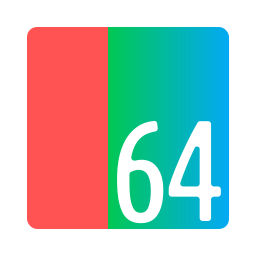
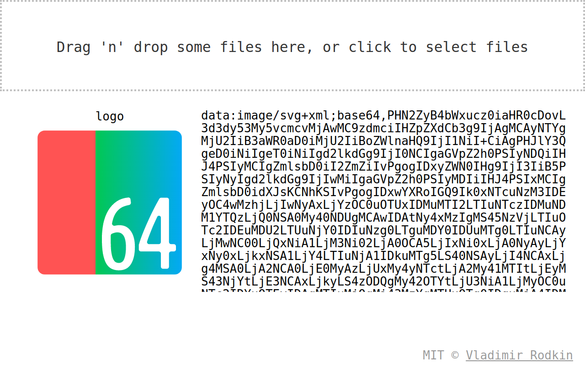

# convert2base64



[![Dependency Status][depstat-image]][depstat-url]
[![DevDependency Status][depstat-dev-image]][depstat-dev-url]

> Convert file to base64

Demo: [vovanr.github.io/convert2base64][demo]



## Start

```shell
npm start
```

## Test

```shell
npm test
```

## Techs

- [Create React App](https://github.com/facebook/create-react-app)


## License
MIT © [Vladimir Rodkin](https://github.com/VovanR)

[demo]: https://vovanr.github.io/convert2base64

[depstat-url]: https://david-dm.org/VovanR/convert2base64
[depstat-image]: https://david-dm.org/VovanR/convert2base64.svg?style=flat-square

[depstat-dev-url]: https://david-dm.org/VovanR/convert2base64
[depstat-dev-image]: https://david-dm.org/VovanR/convert2base64/dev-status.svg?style=flat-square

